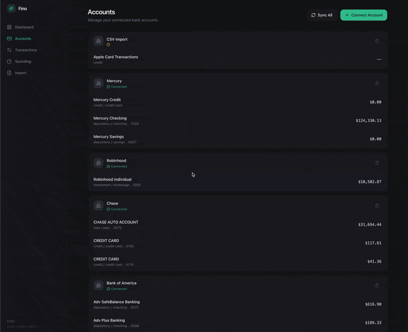
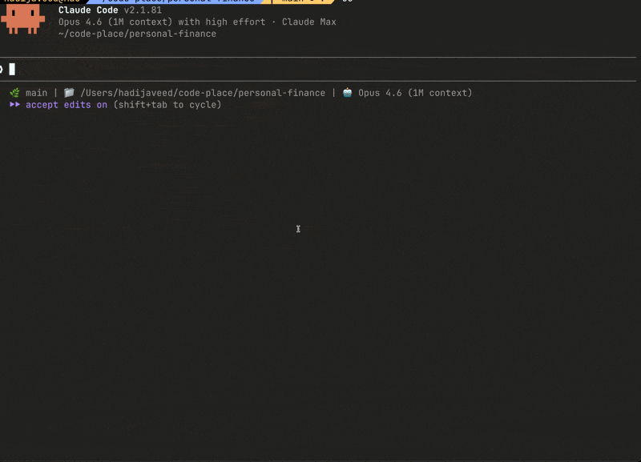

# Fino

Local-first personal finance with AI. Connect your bank accounts, analyze spending, and talk to your money through Claude.

Your data stays on your machine. No cloud. No subscription. Open source.

<p align="center">
  
</p>

<p align="center">
  
</p>

---

## Table of Contents

1. [Quick Start](#1-quick-start)
2. [Plaid Setup](#2-plaid-setup)
3. [Connect Bank Accounts](#3-connect-bank-accounts)
4. [Claude Integration](#4-claude-integration)
5. [Architecture](#5-architecture)
6. [Scripts](#6-scripts)

---

## 1. Quick Start

```bash
git clone <repo-url> fino
cd fino
npm install
cd client && npm install --legacy-peer-deps && cd ..
```

Create your environment file:

```bash
openssl rand -hex 32        # generates your encryption key
cp .env.example .env         # then edit .env with your values
```

```
PLAID_CLIENT_ID=your_client_id
PLAID_SECRET=your_secret
PLAID_ENV=production # apply for the Plaid production account. Free for personal usage upto 5 accounts
ENCRYPTION_KEY=paste_64_char_hex_here
PORT=3001
SYNC_THRESHOLD_HOURS=4
```

Set up the database and run:

```bash
npm run db:push
npm run go
```

Open [http://localhost:3001](http://localhost:3001).

---

## 2. Plaid Setup

Plaid connects to your bank accounts automatically. **Plaid is optional.** If you don't want to set up Plaid, you can skip this section entirely and import transactions via CSV/OFX files instead (see [Connect Bank Accounts > Via CSV/OFX Import](#via-csvofx-import)).

There are two Plaid portals (they are separate accounts):

- **dashboard.plaid.com** -- developer dashboard where you get API keys (this is what you need)
- **my.plaid.com** -- consumer portal for managing data sharing (you don't need this)

### Get Sandbox Keys Not needed though production is important, takes few hours to get approved (instant, fake data)

1. Go to [dashboard.plaid.com](https://dashboard.plaid.com) and sign up
2. Select **Business or developer**
3. Enter a company name, verify your email
4. Go to **Developers > Keys** in the left sidebar
5. Copy your **Client ID** and **Sandbox secret**

Sandbox lets you test the full app with fake bank data. Use these test credentials when connecting:

- Username: `user_good` / Password: `pass_good` / 2FA: `1234`

### Get Production Keys (free, real data)

Production access is free for personal use. Once you have sandbox working:

1. On the dashboard home page, click **"Test with real data"** or **"Unlock real data"**
2. Fill out the form: name, phone, short description (e.g., "personal finance tracking")
3. Click **Request Access**. Approval is usually within minutes
4. Once approved, a **Production secret** appears on **Developers > Keys**
5. Update `.env`:
   ```
   PLAID_SECRET=your_production_secret
   PLAID_ENV=production
   ```
6. Restart the server. Non-OAuth banks work immediately (Venmo, Discover, PayPal, most credit unions)

### Unlock OAuth Banks (BofA, Chase, Amex)

Major banks use OAuth and require a one-time registration. Still free.

1. Click **"Get production access"** in the left sidebar
2. Fill out three sections:
   - **Company Profile**: company name, legal entity name (skip Legal Entity Identifier), address
   - **App Profile**: app name, 1024x1024 PNG icon, description of what the app does
   - **Data Security**: how you handle data (for personal use, keep answers simple)
3. Go to **Developers > API** and add redirect URIs:
   - `http://localhost:5173/`
   - `http://localhost:3001/`
4. Submit. Plaid reviews each OAuth institution individually
5. Check status at **Developers > API > OAuth institutions**

Some banks enable instantly (Citibank). Others takes couple of hours. You can connect whatever is already enabled while waiting for the rest.

---

## 3. Connect Bank Accounts

### Via Plaid (automatic sync)

1. Open the app and go to the **Accounts** page
2. Click **Connect Account**
3. Search for your bank, log in, and select accounts
4. Transactions sync automatically. Balances appear immediately, transactions may take a few minutes on the first pull
5. Click **Sync All** anytime to pull the latest data

### Via CSV/OFX Import

For banks Plaid cannot connect to (Apple Card, or banks pending OAuth approval):

1. Export transactions from your bank's website as CSV or OFX
2. Go to the **Import** page in the dashboard
3. Drag and drop the file, select or create an account, confirm
4. Duplicates are automatically skipped on re-import

Apple Card: export from [card.apple.com](https://card.apple.com) > Statements > Export Transactions.

The CSV parser auto-detects Apple Card format and generic bank CSVs. OFX/QFX files from any bank are also supported.

---

## 4. Claude Integration

### Install

One command sets up everything for Claude Code, Claude Desktop, and Cowork:

```bash
npm run install-claude
```

This configures the Fino MCP server and installs all slash commands globally. Restart Claude after running this.

**The MCP server runs independently.** You do not need the web server running. Claude spawns Fino automatically when you ask about your finances.

### MCP Server Configuration

The MCP server needs access to your `.env` file for Plaid credentials. Add the Fino server to your MCP client config:

**Claude Code** (`~/.claude.json` under `mcpServers`):

```json
{
  "fino": {
    "type": "stdio",
    "command": "npx",
    "args": ["tsx", "/path/to/fino/mcp/index.ts"],
    "env": {
      "PLAID_CLIENT_ID": "your_client_id",
      "PLAID_SECRET": "your_secret",
      "PLAID_ENV": "production",
      "ENCRYPTION_KEY": "your_64_char_hex_key",
      "DOTENV_CONFIG_PATH": "/path/to/fino/.env"
    }
  }
}
```

**Claude Desktop** (`claude_desktop_config.json`):

```json
{
  "mcpServers": {
    "fino": {
      "command": "npx",
      "args": ["tsx", "/path/to/fino/mcp/index.ts"],
      "env": {
        "PLAID_CLIENT_ID": "your_client_id",
        "PLAID_SECRET": "your_secret",
        "PLAID_ENV": "production",
        "ENCRYPTION_KEY": "your_64_char_hex_key",
        "DOTENV_CONFIG_PATH": "/path/to/fino/.env"
      }
    }
  }
}
```

Replace `/path/to/fino` with your actual Fino install directory and fill in your credentials from `.env`. The `npm run install-claude` script does this automatically.

**Why pass env vars?** MCP clients spawn the server as a child process. The working directory and environment may differ from your terminal, so dotenv file loading is unreliable. The `npm run install-claude` script reads your `.env` and passes the values directly to the MCP config. If you're configuring manually, copy the env vars from your `.env` into the config's `env` block.

The MCP config lives in `~/.claude.json` (Claude Code) or `claude_desktop_config.json` (Claude Desktop), both outside the repo. Your secrets never get committed.

### Slash Commands

| Command           | What it does                                                      |
| ----------------- | ----------------------------------------------------------------- |
| `/snapshot`       | Quick health check: balances, net worth, this month vs last       |
| `/monthly-report` | Full month report with categories, top merchants, trends          |
| `/spending-audit` | 90 days of spending: recurring charges, waste, patterns           |
| `/find-charges`   | Search a merchant: total spent, frequency, annual cost            |
| `/cash-flow`      | 6-month income vs expense trend with savings rate and projections |
| `/sync`           | Force sync all bank accounts                                      |

You can also ask naturally: "what did I spend on food this month?" or "show me my net worth."

### MCP Tools

**Data tools:**

| Tool                     | Description                     |
| ------------------------ | ------------------------------- |
| `sync_transactions`      | Force sync with Plaid           |
| `get_accounts`           | List accounts with balances     |
| `get_transactions`       | Query transactions with filters |
| `search_transactions`    | Search by merchant name         |
| `get_balances`           | Net worth breakdown             |
| `get_spending_summary`   | Spending by category            |
| `get_monthly_comparison` | Income vs spending per month    |

**Memory tools (learnings persist across conversations):**

| Tool                     | Description                                            |
| ------------------------ | ------------------------------------------------------ |
| `search_learnings`       | Search stored financial memories by description        |
| `get_learning`           | Load full content of a specific memory by ID           |
| `save_learning`          | Store a financial insight, pattern, rule, or goal      |
| `mark_learning_stale`    | Archive a memory (kept for history, excluded from search) |
| `delete_learning`        | Permanently remove a memory                            |

All read tools auto-sync with Plaid when data is older than `SYNC_THRESHOLD_HOURS` (default 4).

---

## 5. Architecture

```
server/          Hono API + static file serving
client/          React + Vite dashboard
mcp/             MCP server (stdio, 7 tools)
.claude/skills/  Slash command definitions
data/            SQLite database (gitignored)
```

Stack: Hono, React 19, Vite, SQLite (libsql), Drizzle ORM, Plaid API, Tailwind CSS, Recharts.

Data is stored locally in `data/finance.db`. Plaid access tokens are encrypted at rest with AES-256-GCM.

---

## 6. Scripts

| Command                  | What it does                    |
| ------------------------ | ------------------------------- |
| `npm run go`             | Build frontend + start server   |
| `npm run dev`            | Development with hot reload     |
| `npm run build`          | Build frontend only             |
| `npm start`              | Start server only               |
| `npm run db:push`        | Create/migrate database         |
| `npm run install-claude` | Install MCP + skills for Claude |
